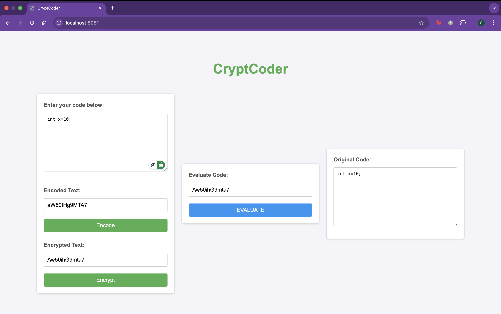

# CryptCoder

A powerful and user-friendly app that enables secure encoding and encryption of your data, while seamlessly decoding and decrypting it on the other end. Whether for personal or professional use, it ensures your information remains protected and accessible only to the intended recipient.

**Keywords:** NodeJS, ExpressJS, HBS, Encryption, and base64 Encoding.

## How to Start the Application

```bash
   git clone <repository-url>
   cd CryptCoder
   npm install
   npm start
```

Open the browser and visit http://localhost:8081!

## Description of Key Files and Folders

- **node_modules/**: Contains all the project dependencies installed via `npm`.
- **public/assets/**:
  - **css/style.css**: Contains the styles for the web application.
  - **js/script.js**: Handles client-side JavaScript logic like encoding and encryption.
  - **index.html**: A fallback HTML file (optional if using Handlebars for rendering).
- **views/index.hbs**: The main Handlebars template used for rendering the application UI.
- **app.js**: Contains the Express server logic, including routes and middleware.
- **package.json**: Metadata for the project, including dependencies and scripts.
- **README.md**: This documentation file.
- **LICENSE**: License file for the project.

This structure ensures clarity and modularity, making it easy for others to navigate and contribute to the project.

## How to Use the Application

Follow these steps to use the application effectively:

### Step 1: Input Your Code

1. Open the application in your browser.
2. Enter the text you want to encode and encrypt in the **"Enter your code below"** text area.

### Step 2: Encode the Text

1. Click the **"Encode"** button.
2. The application will convert your input text into Base64 format.
3. The encoded text will appear in the **"Encoded Text"** field.

### Step 3: Encrypt the Encoded Text

1. Click the **"Encrypt"** button.
2. The application will encrypt the Base64-encoded text using a secure cipher.
3. The encrypted text will appear in the **"Encrypted Text"** field.

### Step 4: Evaluate the Encrypted Text

1. Copy the **Encrypted Text** into the **Evaluate Code** input field.
2. Click the **"EVALUATE"** button to send the encrypted text to the server for processing.
3. The server will:
   - **Decrypt** the encrypted text back to its Base64-encoded form.
   - **Decode** the Base64 text to retrieve your original input.

### Step 5: View the Original Text

1. The server will send the decoded original text back to the application.
2. The original text will be displayed for you to verify.

This step-by-step process ensures that your data is securely handled while demonstrating how encoding, encryption, decryption, and decoding work together.

## Application


